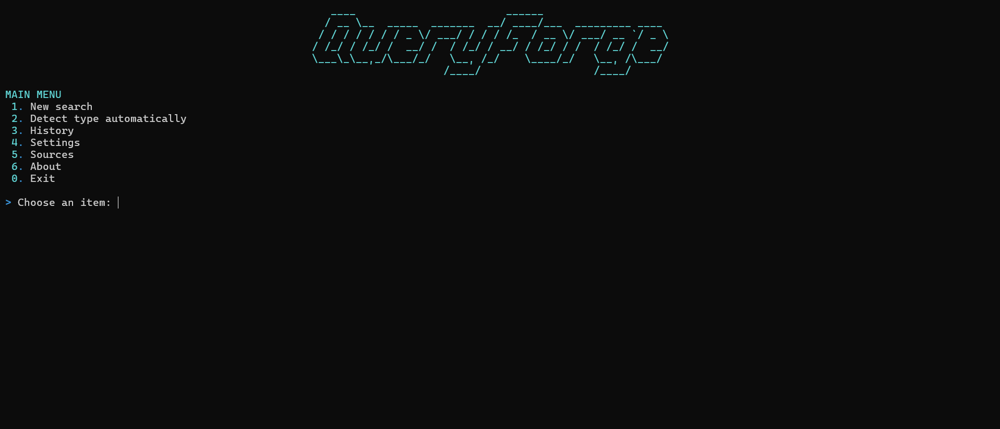
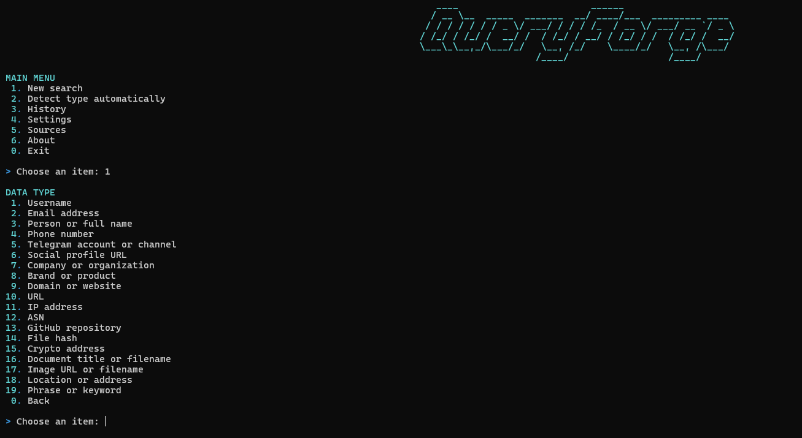
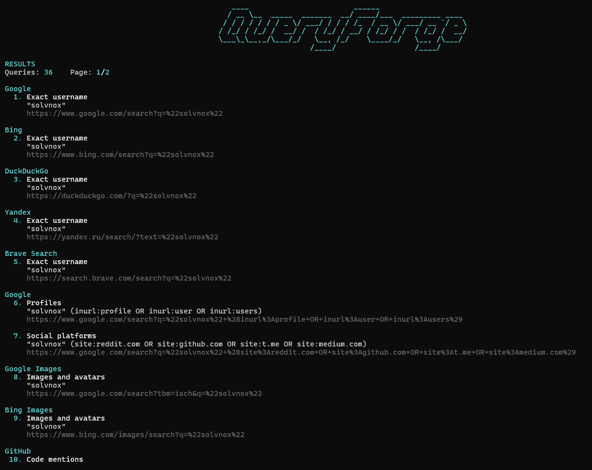
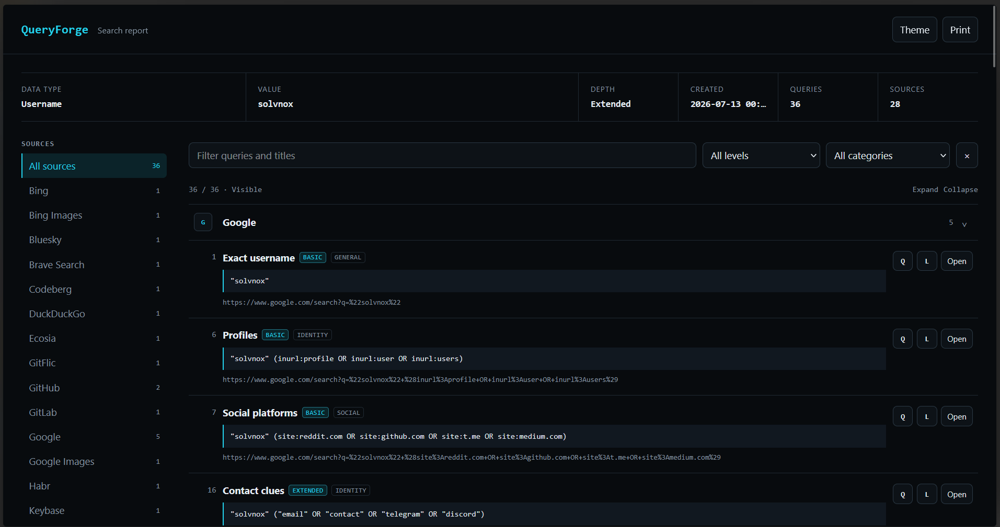
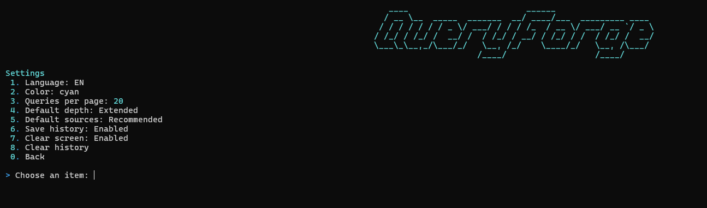

<p align="center">
  
</p>

<h1 align="center">QueryForge</h1>

<p align="center">
  A local CLI application for building structured OSINT search plans from a known value.
</p>

<p align="center">
  <a href="README_RU.md">Русская версия</a>
  ·
  <a href="#installation">Installation</a>
  ·
  <a href="#usage">Usage</a>
  ·
  <a href="#screenshots">Screenshots</a>
  ·
  <a href="#extending-queryforge">Templates</a>
</p>

<p align="center">
  
  
  
  
  
  
</p>

---

## Overview

QueryForge turns a username, email address, domain, company name, IP address or another known value into a set of search queries and direct links for public sources.

The program does not scrape websites and does not decide whether search results belong to the same person or organization. It prepares a repeatable search plan, groups queries by source and leaves the review of results to the investigator.

The interface is fully interactive. Start the program with `python main.py`, choose menu items by number and press Enter. Command-line flags are not required.

### Current catalog

| Component | Count |
|---|---:|
| Data types | 19 |
| Public sources | 125 |
| Query templates | 711 |
| Search depth levels | 3 |
| Export formats | 4 |
| Interface languages | 2 |

### Main capabilities

- Numeric terminal menus without arrow-key navigation
- Russian and English interface
- Automatic value type detection
- Basic, extended and full search depth
- Recommended, grouped, all or manual source selection
- Direct browser opening for one or several generated queries
- Local search history with a configurable on/off switch
- Standalone HTML reports
- JSON, CSV and Markdown export
- YAML-based source and entity catalogs
- Separate support for Yandex Search, Images, Maps, News and Video
- Public sources and registries for Russia, Ukraine, Belarus, Kazakhstan, Uzbekistan, Armenia, Kyrgyzstan, Georgia and Moldova
- No API keys required by QueryForge itself

> Some destination services may require authentication, show CAPTCHA, restrict access by region or change their public search URLs.

---

## Screenshots

### Main menu

<p align="center">
  
</p>

The main menu is intentionally simple: every action has a number, and the selected number is confirmed with Enter. From here you can start a new search, let QueryForge detect the value type, reopen previous searches, change settings, inspect the source catalog or view program information. The interface does not require mouse input or arrow-key navigation.

### Data type selection

<p align="center">
  
</p>

The data type determines which placeholders, validation rules and query templates are used. QueryForge currently supports identity data, organizations, web infrastructure, technical indicators, documents, images, locations and free-form phrases. Each item shows an example so the expected input format is clear before the search starts.

### Generated search plan

<p align="center">
  
</p>

Generated queries are displayed with the source name, purpose, query text and direct link. Results can be viewed page by page, opened individually or opened as a selected group. QueryForge removes duplicate source/query/link combinations before displaying them and keeps the original search depth and category for export.

### HTML report

<p align="center">
  
</p>

The HTML report is a standalone file with embedded CSS and JavaScript. It can be opened locally without a server and does not load interface assets from a CDN. The report includes source navigation, text search, filters by depth and category, collapsible source groups, copy buttons, direct links, dark and light themes, responsive layout and a print view.

### Settings

<p align="center">
  
</p>

Settings are changed through the same numeric interface. Available options include language, accent color, result page size, default search depth, default source mode, history storage and automatic screen clearing. Changes are saved locally and loaded on the next launch.

---

## How it works

1. Enter a known value or use automatic type detection.
2. Select the data type.
3. Choose the search depth.
4. Select recommended sources, all available sources, a source group or individual sources.
5. Review the generated queries.
6. Open selected links in the browser or save a report.

```text
Known value
    │
    ├── Data type
    ├── Search depth
    └── Source selection
            │
            ▼
      Query generation
            │
            ├── Open in browser
            ├── HTML report
            ├── JSON
            ├── CSV
            └── Markdown
```

### Search depth

| Level | Purpose |
|---|---|
| Basic | Small high-signal set for an initial check |
| Extended | Broader coverage across additional source types |
| Full | All templates available for the selected entity and sources |

### Source selection modes

| Mode | Behavior |
|---|---|
| Recommended | Uses the source set assigned to the selected data type |
| All available | Uses every source that has templates for the selected data type |
| Source group | Limits the search to a category such as archives, maps or code |
| Manual | Accepts individual source numbers and numeric ranges |

---

## Supported data types

| Area | Data types |
|---|---|
| Identity | Username, email, person, phone, Telegram identifier, social profile |
| Organizations | Company, brand |
| Web | Domain, URL |
| Technical | IP address, ASN, GitHub repository, hash |
| Other | Cryptocurrency address, document, image, location, phrase |

Automatic detection recognizes structured values such as email addresses, URLs, domains, IP addresses, AS numbers, common hashes, GitHub repositories, Telegram identifiers and several cryptocurrency address formats. Ambiguous values can always be assigned manually.

---

## Source catalog

The catalog is divided into 11 source groups.

| Group | Sources | Examples |
|---|---:|---|
| Search engines | 11 | Google, Yandex, Bing, DuckDuckGo, Brave Search, Startpage |
| Image search | 5 | Google Images, Yandex Images, Bing Images, Google Lens |
| News and media | 4 | Google News, Yandex News, Bing News, GDELT |
| Code and development | 6 | GitHub, GitLab, Sourcegraph, Codeberg, GitFlic |
| Social and communities | 22 | Reddit, VK, TGStat, Habr, Bluesky, LinkedIn |
| Archives | 4 | Wayback Machine, Archive.today, Internet Archive, Arquivo.pt |
| Companies and registries | 20 | OpenCorporates, Rusprofile, Companies House, GLEIF |
| Technical data | 19 | Shodan, Censys, VirusTotal, urlscan.io, RDAP.org |
| Packages and publications | 19 | ORCID, Crossref, OpenAlex, PyPI, arXiv, PubMed |
| Maps | 5 | Google Maps, Yandex Maps, 2GIS, OpenStreetMap |
| Blockchain | 10 | Etherscan, Blockchair, Solscan, Tronscan, BscScan |

<details>
<summary><strong>Full source list</strong></summary>

### Search engines

Google, Bing, DuckDuckGo, Yandex, Brave Search, Startpage, Qwant, Mojeek, Ecosia, Yahoo Search and Rambler Search.

### Image search

Google Images, Bing Images, Yandex Images, Wikimedia Commons and Google Lens.

### News and media

Google News, Bing News, Yandex News and GDELT.

### Code and development

GitHub, GitLab, Sourcegraph, Codeberg, GitFlic and Bitbucket.

### Social and communities

Reddit, YouTube, Medium, Stack Overflow, Gravatar, VK, Odnoklassniki, RUTUBE, TGStat, Habr, Pikabu, Bluesky, TikTok, Twitch, Flickr, SoundCloud, Pinterest, LinkedIn, Facebook, Keybase, Steam Community and Yandex Video.

### Archives

Wayback Machine, Archive.today, Internet Archive and Arquivo.pt.

### Companies and registries

OpenCorporates, OpenSanctions, Wikidata, Rusprofile, Checko, ЕГРЮЛ/ЕГРИП, ЕИС Закупки, YouControl, Opendatabot, Adata.kz, КГД Казахстана, Orginfo.uz, ЕГР Беларуси, UK Companies House, SEC EDGAR, GLEIF LEI Search, Armenia e-Register, Kyrgyzstan Legal Entities Register, Georgia Business Registry and Moldova Company Search.

### Technical data

Shodan, Censys, urlscan.io, VirusTotal, AbuseIPDB, BGPView, crt.sh, ICANN Lookup, PeeringDB, AlienVault OTX, MalwareBazaar, RDAP.org, IPinfo, Hurricane Electric BGP Toolkit, Robtex, URLhaus, ThreatFox, Pulsedive and GreyNoise Visualizer.

### Packages and publications

ORCID, Crossref, Google Scholar, OpenAlex, npm, PyPI, Docker Hub, Hugging Face, crates.io, RubyGems, Packagist, Maven Central, PubMed, arXiv, Semantic Scholar, Research Organization Registry, WorldCat, VIAF and Google Patents.

### Maps

Google Maps, OpenStreetMap, Yandex Maps, 2GIS and Bing Maps.

### Blockchain

Etherscan, Blockchair, Solscan, Tronscan, Tonviewer, Blockchain.com Explorer, BscScan, PolygonScan, Arbiscan and BaseScan.

</details>

### CIS coverage

QueryForge contains dedicated templates for regional search engines, social platforms, media sites, maps and business registries. The catalog includes Yandex services, VK, Odnoklassniki, TGStat, RUTUBE, Habr, Pikabu, 2GIS, Rusprofile, Checko, ЕГРЮЛ/ЕГРИП, ЕИС Закупки, YouControl, Opendatabot, Adata.kz, КГД Казахстана, Orginfo.uz, ЕГР Беларуси and public registries for Armenia, Kyrgyzstan, Georgia and Moldova.

Some government portals do not support prefilled search values in the URL. For those services QueryForge opens the correct public search page and keeps the prepared value visible in the generated report for manual entry.

See [CIS source notes](docs/CIS_SOURCES.md) and [source audit notes](docs/SOURCE_AUDIT.md).

---

## Installation

### Requirements

- Python 3.10 or newer
- Git, or a downloaded repository archive
- A terminal with UTF-8 support

### Windows

```powershell
git clone <repository-url>
cd QueryForge

python -m venv .venv
.venv\Scripts\activate

python -m pip install --upgrade pip
pip install -r requirements.txt

python main.py
```

### Linux and macOS

```bash
git clone <repository-url>
cd QueryForge

python3 -m venv .venv
source .venv/bin/activate

python -m pip install --upgrade pip
pip install -r requirements.txt

python main.py
```

The program can also be started without Git after downloading and extracting the repository archive.

---

## Usage

Start QueryForge from the project directory:

```bash
python main.py
```

The normal workflow is:

```text
1. New search
2. Select a data type
3. Enter a value
4. Select depth
5. Select sources
6. Review or export the generated queries
```

Automatic detection is available from the main menu. It proposes one or more likely data types and lets you confirm the correct one before continuing.

When opening multiple queries, QueryForge limits one batch to 10 browser tabs to avoid accidentally flooding the browser.

---

## HTML reports

HTML is the main human-readable report format.

Reports are saved to:

```text
output/
```

A typical filename looks like this:

```text
domain_example.com_20260712_231530.html
```

Each report contains:

- Searched value and selected data type
- Search depth
- Creation time
- Query and source counts
- Sidebar navigation by source
- Text filtering
- Depth and category filtering
- Collapsible source groups
- Query copy buttons
- Direct links to public services
- Dark and light themes
- Responsive mobile layout
- Print-friendly output

The report is self-contained. It can be moved, archived or opened on another computer without installing QueryForge.

### Other export formats

| Format | Use |
|---|---|
| JSON | Structured output for scripts and other tools |
| CSV | Spreadsheet import and manual review |
| Markdown | Notes, documentation and case files |
| HTML | Interactive local report |

---

## Local data and privacy

QueryForge keeps settings and history outside the repository.

### Windows

```text
%USERPROFILE%\.queryforge\settings.json
%USERPROFILE%\.queryforge\history.json
```

### Linux and macOS

```text
~/.queryforge/settings.json
~/.queryforge/history.json
```

History stores up to 100 recent searches. It can be disabled or cleared from the interface. Deleting `settings.json` resets the program to default settings. Deleting `history.json` clears saved history. Both files are recreated automatically when needed.

The storage locations can be changed with environment variables:

```text
QUERYFORGE_HOME
QUERYFORGE_OUTPUT
```

Example on Windows:

```powershell
$env:QUERYFORGE_HOME = "D:\QueryForgeData"
$env:QUERYFORGE_OUTPUT = "D:\QueryForgeReports"
python main.py
```

Example on Linux or macOS:

```bash
export QUERYFORGE_HOME="$HOME/.local/share/queryforge"
export QUERYFORGE_OUTPUT="$HOME/Documents/QueryForgeReports"
python main.py
```

Query generation is local. QueryForge sends data to an external service only after you choose to open a generated link in the browser. At that point the search value becomes part of the destination URL and is handled according to that service's own privacy policy.

---

## Extending QueryForge

The source catalog and query templates are stored as YAML. New sources and templates can be added without changing the menu or export code.

### Add a source

Edit:

```text
queryforge/data/sources.yaml
```

Example:

```yaml
- id: example_search
  name: Example Search
  group: web
  url_template: https://example.com/search?q={query}
```

Available URL encoding modes:

| Mode | Behavior |
|---|---|
| `query` | Encodes the value for a query-string parameter |
| `path` | Encodes the value as a URL path component |
| `fragment` | Encodes the value for a URL fragment |
| `raw` | Inserts the rendered query without encoding |

### Add a query template

Edit the relevant file in:

```text
queryforge/data/entities/
```

Example:

```yaml
- source: example_search
  level: extended
  title_en: Exact username
  title_ru: Точный ник
  query: '"{username}"'
  category: identity
```

A template can also define a complete direct URL:

```yaml
- source: github
  level: extended
  title_en: GitHub user search
  title_ru: Поиск пользователя GitHub
  query: "{username}"
  category: identity
  url: https://github.com/search?q={username_q}&type=users
```

The engine provides normalized placeholders for usernames, email components, domains, URLs, phone digits, AS numbers, repositories, hashes and other supported entities.

After editing the catalog, run the tests before opening a pull request.

---

## Project structure

```text
QueryForge/
├── .github/
│   └── workflows/
│       └── tests.yml
├── docs/
│   ├── CIS_SOURCES.md
│   └── SOURCE_AUDIT.md
├── output/
│   └── .gitkeep
├── photo/
│   ├── logo.png
│   ├── menu.png
│   ├── data_type.png
│   ├── search.png
│   ├── html_report.png
│   └── settings.png
├── queryforge/
│   ├── data/
│   │   ├── entities/
│   │   ├── report_template.html
│   │   └── sources.yaml
│   ├── app.py
│   ├── browser.py
│   ├── catalog.py
│   ├── config.py
│   ├── detection.py
│   ├── engine.py
│   ├── exporters.py
│   ├── history.py
│   ├── i18n.py
│   ├── menu.py
│   ├── models.py
│   ├── paths.py
│   ├── report.py
│   └── ui.py
├── tests/
├── CHANGELOG.md
├── CONTRIBUTING.md
├── LICENSE
├── PROJECT_MAP.md
├── README.md
├── README_RU.md
├── main.py
├── requirements-dev.txt
└── requirements.txt
```

---

## Tests

Install development dependencies:

```bash
pip install -r requirements-dev.txt
```

Run the test suite:

```bash
pytest
```

The tests cover catalog loading and validation, automatic detection, query rendering, menu parsing, exporters, the CLI flow and repository structure.

---

## Limitations

- QueryForge generates queries and links; it does not verify search results.
- A matching username, email, avatar or organization name is not proof of identity.
- Search operators and public URLs can change over time.
- External services may require sign-in, JavaScript, CAPTCHA or regional access.
- Some services provide a search form but do not allow the value to be prefilled in the URL.
- Full-depth searches can produce a large number of browser links; review the generated plan before opening them.

Broken or changed sources can be reported through GitHub Issues. Include the source name, generated URL and expected behavior.

---

## Responsible use

Use QueryForge only for lawful work with public information. Respect privacy, local law and the terms of the services you open through generated links.

QueryForge does not establish ownership, identity or intent. Conclusions should be based on reviewed evidence from independent sources, not on a single search result.

---

## Contributing

Pull requests for new public sources, corrected URLs, regional registries, translations and query templates are welcome.

Before submitting a change:

1. Keep the source publicly accessible.
2. Confirm that the generated URL opens the intended search page.
3. Use clear English and Russian template titles.
4. Avoid duplicate source/query/link combinations.
5. Run `pytest`.
6. Update documentation when adding a new source group or data type.

See [CONTRIBUTING.md](CONTRIBUTING.md) for the repository guidelines.

---

## License

QueryForge is released under the [MIT License](LICENSE).
